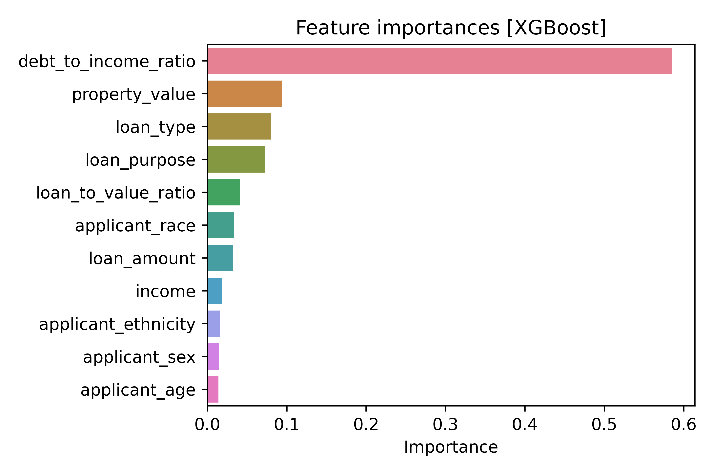

## Home mortgage approval/denial in California counties

**Henrique Martins**

### Executive summary

### Rationale

Understanding the factors that lead to home mortgage approval or denial is crucial for both borrowers and lenders. For borrowers, it can help them discover their eligibility. For lenders, it can improve risk assessment, make the application process faster, and potentially identify areas where lending practices may need to be adjusted to ensure fairness. Additionally, policymakers and researchers can utilize these insights to address systemic issues and promote equitable access to homeownership.

### Research Question

What are the reasons and factors that lead to home mortgage approval or denial? This project aims to answer the question by analysing and modeling real world data from California counties using multiple machine learning models.

### Data Sources

I used the [U.S. Home Mortgage Disclosure Act (HMDA) database] as the source of my datasets. My focus is on the SF East Bay counties, namely *Alameda County* and *Contra Costa County*, ranging from 2019 to 2022. The dataset can be downloaded [here](https://ffiec.cfpb.gov/data-browser/data/2022?category=states&items=CA), and the [documentation] explains all the dataset fields.
  
### Methodology

1) Data cleaning and preprocessing
2) Analysis and further processing
3) Model selection, training, and evaluation

### Results

#### 1. Data cleaning and preprocessing <small>([file_1_preprocessing.ipynb])</small>

- As fetched the data contains 616388 rows and 99 columns.
- All features are mapped into either numbers or categories, converting their values using the data documentation and grouping them into a new value whenever reasonable.
- Some features are pre-filtered due to outliers.
- All missing values are dealt with.
- Output of this step are 549263 rows and 38 columns.

#### 2. Data analysis <small>([file_2_analysis.ipynb])</small>

- The data set at the start of this step is heavily imbalanced towards Approved applications, with only 13.8% being denied. This is because almost half of the entries are entities applying for loans, and they are all approved. The data was filtered to only have people. That removed most of the target imbalance (now 34%/66%), but reduced the data set to 219267 samples.
- *The main reason for denial of application is debt-to-income ratio*, followed by credit application incomplete and credit history. Most approved applicants have a debt/income ratio of around 0.3, while above 0.5 the applications are mostly all denied.
- *The application success rate depends on the age of the applicant*: for ages below 25 the approval rate is around 50%, and it increases to around 75% between ages of 25-34. Beyond that it decreases as the age increases, going back to 50% for applicants above 74 years old.
- *The main applicant’s sex seems to play a role in the application outcome*. Male applicants have around 70% approval rate, whereas female applicants are around 57%. If we group both the applicant and co-applicant’s sex together, the approval rate for male-male goes down to 62%, while filing having both sexes has an approval rate of around 73%. Female-female remains around 55%.
- *Ethnicity matters*: The approval rate is around 81% for Hispanic/Latino ethnicity and 87% for non Hispanic/Latino ethnicity.
- *Race matters*: The approval rate for Asian and White races is around 70% and higher than for Native Americans, Pacific Islanders, and Blacks/African Americans which sit at around 42%.
- *Loan purpose*: If the purpose of the loan is to buy a house the approval rate is high, around 80%, while if it is to refinance it or improve it the approval rates goes down to around 60%.
- *Income*: The approval rate goes above 50% for incomes above US$ 150 thousand per year. Most of the denied applicants have incomes lower than that.
- *Property value*: The property value has a similar distribution to the income, with most denied applicants having used a property valued at less than US$ 1 million to secure the loan.

#### 3. Models

##### 3.1. Performances

Here are the main metrics for all trained models:

| Model | Train score | Test score | Precision  | Precision | Precision  | Recall   |
| :---: | :---------: | :--------: | :--------: | :-------: | :--------: | :------: |
|       |             |            | *Approved* | *Denied*  | *Approved* | *Denied* |
| DummyClassifier      | 0.658 | \-    | \-   | \-   | \-   | \-   |
| LogisticRegression   | 0.770 | 0.773 | 0.77 | 0.78 | 0.93 | 0.46 |
| Decision Tree        | 0.796 | 0.798 | 0.79 | 0.81 | 0.93 | 0.54 |
| Support Vector       | 0.786 | 0.788 | 0.79 | 0.79 | 0.93 | 0.51 |
| HistGradientBoosting | 0.740 | 0.743 | 0.80 | 0.82 | 0.94 | 0.55 |
| AdaBoost             | 0.785 | 0.788 | 0.77 | 0.85 | 0.96 | 0.46 |
| Random Forest        | 0.798 | 0.797 | 0.78 | 0.86 | 0.96 | 0.49 |
| **XGBoost**          | **0.808** | **0.804** | **0.80** | **0.83** | **0.94** | **0.53** |
| Neural Network       | 0.797 | 0.802 | 0.80 | 0.81 | 0.93 | 0.55 |

The XGBoost is the model that seemed to perform better overall at classifying the outcome of the applications. Here is the feature importances according to the XGBoost model:



- *Debt/income ratio* is by far the most influential factor, suggesting that the model heavily relies on this metric to assess the applicant's financial risk.
- *Property value*: given a good debt/income ratio, the value of the property proposed to secure the loan has a strong influence on the outcome. The *loan type* and the *purpose* of the loan also affect in the same order of magnitude.
- *Fairness and Bias*: The low importance of demographic features might appear positive from a fairness perspective. However, as noticed during the EDA phase, there is influence (direct or indirect) on the application outcome.

##### 3.2. Comments and details about the models

###### Part A: Simple classifiers <small>([file_3A_modeling-classifiers.ipynb])</small>

- Classifiers considered here: DummyClassifier, Logistic Regression, Decision Tree, Support Vectors
- The DummyClassifier is the baseline with 65.8% accuracy (% of Approved applications)
- All classification models resulted in more or less the same best score, for all classifiers, with Logistic Regression trailing behind.
- The faster and still very accurate model seem to be Decision Tree, achieving around 80% accuracy.
- They perform very well for the Approved label, with a recall >0.90, however, they fall short on the recall for the Denied applications with values around 0.5.

###### Part B: Ensembles <small>([file_3B_modeling-ensembles.ipynb])</small>

- Classifiers considered here: HistGradientBoosting, AdaBoost, Random Forest.
- *HistGradientBoosting*: fast but lower accuracy than the other two. It did achieve the highest recall for the Denied applications, but it is still poor at 55%.
- *AdaBoost*: good accuracy with fast speed.
- *Random Forest*: searched for more hyperparameters and achieved better accuracy at almost 80%.

###### Part C: XGBoost <small>([file_3C_modeling-XGBoost.ipynb])</small>

- Booster: DART with 10% dropout rate.
- ```binary:logistic``` as objective function.
- Used early stopping while tracking AUC-PR and tracked classification error at multiple thresholds.
- Best accuracy over all models with very good recall values.

###### Part D: Neural Network <small>([file_3D_modeling-NN.ipynb])</small>

- Only one dense layer with 100 units and ReLU activation was considered.
- 10% dropout rate and batch_size of 512.
- Very good metric performances but hard to interpret.

#### Outline of project

- [file_1_preprocessing.ipynb]: Loading and pre-processing the data
- [file_2_analysis.ipynb]: Analysis of the data and further processing
- [file_3A_modeling-classifiers.ipynb]: Models, part A: Classifiers
- [file_3B_modeling-ensembles.ipynb]: Models, part B: Ensembles
- [file_3C_modeling-XGBoost.ipynb]: Models, part C: XGBoost
- [file_3D_modeling-NN.ipynb]: Models, part D: Neural Network
- [modeling_preparation.py]: Common functions; fetching data for model
- [hdma_slides.pdf]: Slides with figures and more explanations

  [file_1_preprocessing.ipynb]: ./file_1_preprocessing.ipynb
  [file_2_analysis.ipynb]: ./file_2_analysis.ipynb
  [file_3A_modeling-classifiers.ipynb]: ./file_3A_modeling-classifiers.ipynb
  [file_3B_modeling-ensembles.ipynb]: ./file_3B_modeling-ensembles.ipynb
  [file_3C_modeling-XGBoost.ipynb]: ./file_3C_modeling-XGBoost.ipynb
  [file_3D_modeling-NN.ipynb]: ./file_3D_modeling-NN.ipynb
  [modeling_preparation.py]: ./modeling_preparation.py
  [hdma_slides.pdf]: ./slides/hdma_slides.pdf
  [U.S. Home Mortgage Disclosure Act (HMDA) database]: https://ffiec.cfpb.gov/
  [documentation]: https://ffiec.cfpb.gov/documentation/publications/loan-level-datasets/lar-data-fields
